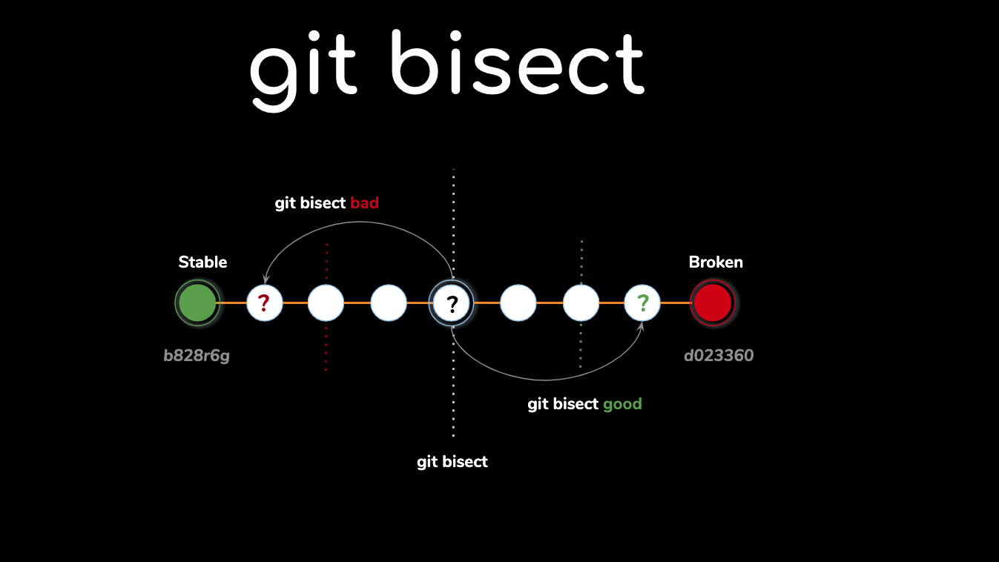
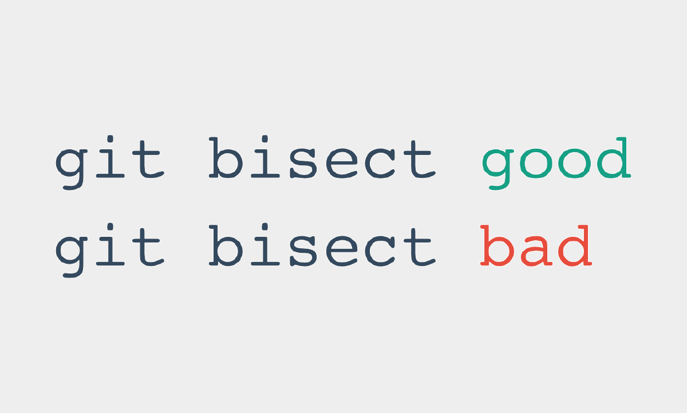
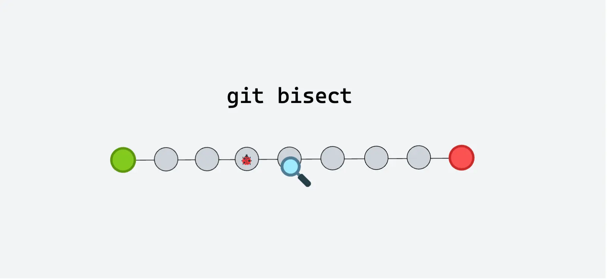

# Como usar git bisect para encontrar um bug

## Objetivo: Aprender a debugar histórico

O `git bisect` é uma ferramenta poderosa que usa **busca binária** para encontrar o commit exato que introduziu um bug no histórico do projeto. Em vez de testar cada commit manualmente, o Git divide o intervalo de commits pela metade, você testa a versão e indica se está **boa** (sem bug) ou **ruim** (com bug). O processo se repete até que o commit culpado seja identificado.

---

## Passo a passo para usar git bisect

### 1. Inicie a busca binária

```sh
git bisect start
````

---

### 2. Marque o commit ruim (com o bug)

Geralmente o commit atual (HEAD) apresenta o bug:

```sh
git bisect bad
```

---

### 3. Marque um commit bom (sem o bug)

Encontre um commit antigo que você sabe que estava funcionando corretamente (pode ser hash ou tag):

```sh
# Usando hash do commit
git bisect good [hash-do-commit]

# Usando tag de versão anterior
git bisect good v1.0.0
```

O Git fará checkout automaticamente de um commit intermediário.



---

### 4. Teste o código

Execute seu código ou seus testes no commit atual para verificar se o bug está presente.

---

### 5. Relate o resultado

* Se o bug estiver presente:

```sh
git bisect bad
```

* Se o bug não estiver presente:

```sh
git bisect good
```

O Git continuará dividindo o intervalo pela metade e fará checkout de outro commit para testar.

---

### 6. Repita até o fim



Continue testando e marcando commits como **good** ou **bad** até que o Git identifique o commit culpado.

---

### 7. Finalize o bisect

Quando o processo terminar, o Git exibirá o hash do commit que introduziu o bug:

```sh
[hash-do-commit] is the first bad commit
```

Para voltar ao seu branch original:

```sh
git bisect reset
```

---

## Exemplo prático

1. Iniciar o bisect:

```sh
git bisect start
git bisect bad        # commit atual contém bug
git bisect good v1.0  # versão antiga sem bug
```

2. O Git fará checkout de um commit intermediário.
3. Teste o commit e informe:

```sh
git bisect bad  # se o bug estiver presente
git bisect good # se não houver bug
```

4. Repita até identificar o commit exato.
5. Finalize com:

```sh
git bisect reset
```

---

## Comandos importantes

| Comando                  | Função                                          |
| ------------------------ | ----------------------------------------------- |
| `git bisect start`       | Inicia o processo de bisect                     |
| `git bisect bad <hash>`  | Marca um commit como contendo o bug             |
| `git bisect good <hash>` | Marca um commit como não contendo o bug         |
| `git bisect reset`       | Sai do modo bisect e retorna ao branch original |

---

## Quando usar

* Para descobrir **quando um bug foi introduzido** no histórico do Git.
* Para identificar a origem de **regressões** ou erros inesperados.

---

## Vantagens

* **Eficiência**: A busca binária reduz exponencialmente o número de commits a testar.
* **Precisão**: Identifica o commit exato que causou o problema.

