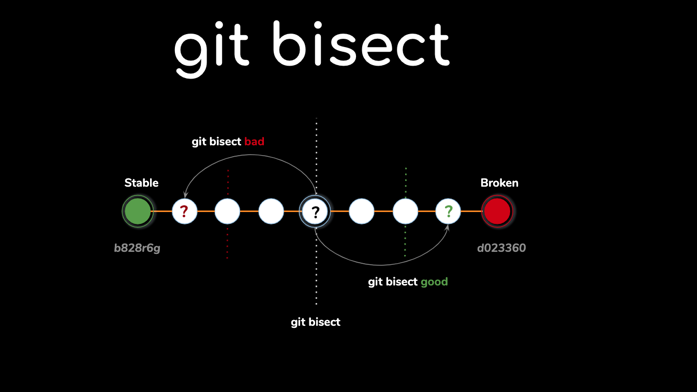
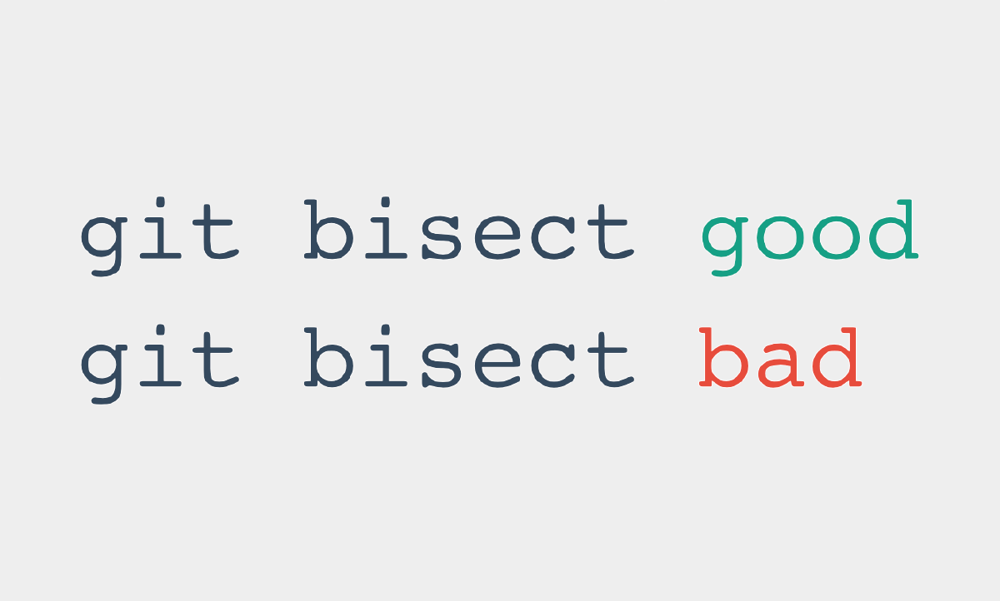

# Como usar bisect para encontrar bug

## Objetivo: Aprender debug histórico.

- O git bisect é uma ferramenta poderosa que usa um algoritmo de busca binária para encontrar eficientemente o commit exato que introduziu um bug em seu histórico. Em vez de verificar manualmente cada commit, o Git divide o histórico pela metade e você testa a versão para dizer se ela está "boa" (sem o bug) ou "ruim" (com o bug).

- O processo é um ciclo de dividir, testar e relatar, até que o commit problemático seja isolado.

### Passo a passo para usar git bisect

1. Inicie a busca binária:

- Comece o processo no seu terminal com o comando:

    `sh
        git bisect start

2. Marque o commit ruim (com o bug):

- Informe ao Git que o commit atual (geralmente o HEAD) está com o bug.

    `sh
        git bisect bad

3. Marque um commit bom (sem o bug):

- Encontre um commit mais antigo que você sabe que funcionava corretamente. Você pode usar o git log para encontrar o hash ou a tag de uma versão anterior.

    ```sh
        # Marque o commit bom usando o hash
        git bisect good [hash-do-commit]

        # Ou marque uma tag de versão anterior
        git bisect good v1.0.0

- Após marcar o commit bom e o ruim, o Git fará automaticamente o checkout de um commit intermediário no histórico.



4. Teste o código:

- Execute seu código ou seus testes para verificar se o bug está presente no commit atual.

5. Relate o resultado:

* Se o bug estiver presente, informe ao Git:

    `sh
        git bisect bad

* Se o bug não estiver presente, informe ao Git:

    `sh
        git bisect good

- O Git continuará a dividir o intervalo restante pela metade e fará o checkout de um novo commit para você testar.

6. Repita até o fim:


- Continue o processo de testar e marcar o commit como good ou bad. O git bisect mostrará quantos passos faltam para encontrar o culpado.

7. Finalize o bisect:

- Quando o processo terminar, o Git identificará e exibirá o hash do commit que introduziu o bug.

    `
        [hash-do-commit] is the first bad commit

- Para retornar ao seu branch original, execute:

    `sh
        git bisect reset

### Exemplo prático

- Vamos supor que um bug apareceu na versão mais recente, mas não existia na versão v1.0.

* 1.
    ```sh
        # Inicia o processo
        git bisect start

        # Marca o commit atual como ruim (bug existe)
        git bisect bad

        # Marca a tag v1.0 como boa (bug não existe)
        git bisect good v1.0

* 2. O Git fará o checkout de um commit no meio do caminho. Teste a aplicação.
* 3. Se o bug estiver lá, você digita git bisect bad. Se não estiver, git bisect good.
* 4. O Git repetirá o processo, e você continuará testando e informando até que o commit exato seja encontrado.
* 5. Ao final, use git bisect reset para voltar ao seu estado de trabalho original.

### Comandos importantes:
* git bisect start: Inicia o processo de bisect. 
* git bisect bad <hash_do_commit>: Marca um commit como contendo o bug. 
* git bisect good <hash_do_commit>: Marca um commit como não contendo o bug. 
* git bisect reset: Sai do modo de bisect e retorna ao branch original. 

#### Quando usar:
* Quando não sabe quando um bug foi introduzido no seu histórico Git. 
* Para encontrar a origem de uma regressão ou um erro inesperado. 

#### Vantagens:
* Eficiência: A busca binária reduz o número de commits a serem testados exponencialmente, tornando o processo rápido, mesmo em históricos longos. 
* Precisão: Permite identificar o commit exato onde um problema foi introduzido.

