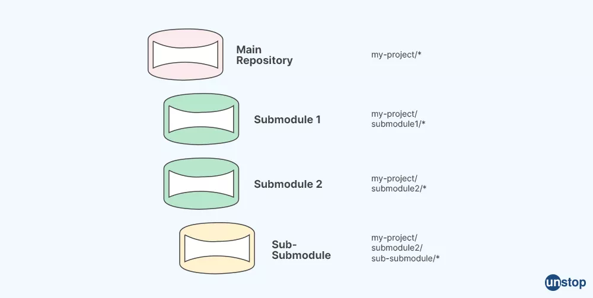

# Git Submodules: Como adicionar um submódulo a um projeto

## Objetivo
Gerenciar dependências Git, incluindo repositórios externos como subdiretórios dentro do seu projeto principal.

---

## O que é um submódulo
- Um submódulo é um repositório Git dentro de outro repositório.
- Mantém o histórico separado do repositório principal.
- Ideal para bibliotecas ou dependências que precisam ser versionadas separadamente.



---

## Passo 1: Adicionar o submódulo

- Use o comando `git submodule add` no diretório raiz do projeto, especificando a URL do repositório e opcionalmente um caminho.

```sh
git submodule add <url_do_repositorio> [caminho]
````

### Exemplo:

```sh
git submodule add https://github.com/exemplo/biblioteca.git libs/biblioteca
```

* O Git clona o repositório do submódulo dentro do diretório especificado e cria um arquivo `.gitmodules`.

---

## Passo 2: Fazer o commit da adição

* Verifique o status e faça o commit das alterações, incluindo o arquivo `.gitmodules`:

```sh
git add .
git commit -m "Adiciona submódulo de biblioteca"
```

---

## Passo 3: Clonar um projeto com submódulos

* Quando outro desenvolvedor clona seu projeto, é necessário inicializar os submódulos para baixar seus conteúdos.

### Opção 1 (recomendado): Clonar já com submódulos

```sh
git clone --recurse-submodules <url_do_projeto_principal>
```

### Opção 2: Inicializar submódulos após o clone

```sh
git submodule init
git submodule update
```

> Dica: Para atualizar submódulos existentes para a versão correta:

```sh
git submodule update --remote
```

---

## Resumo

* Submódulos ajudam a manter dependências versionadas separadamente.
* Sempre faça commit do arquivo `.gitmodules`.
* Quem clona o projeto precisa inicializar ou clonar com `--recurse-submodules`.

