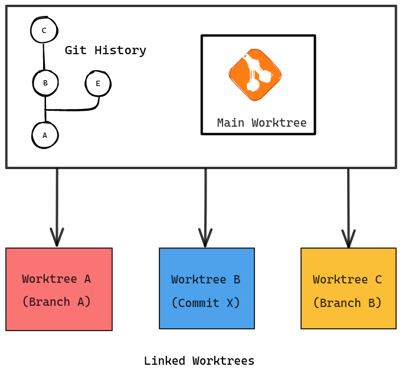
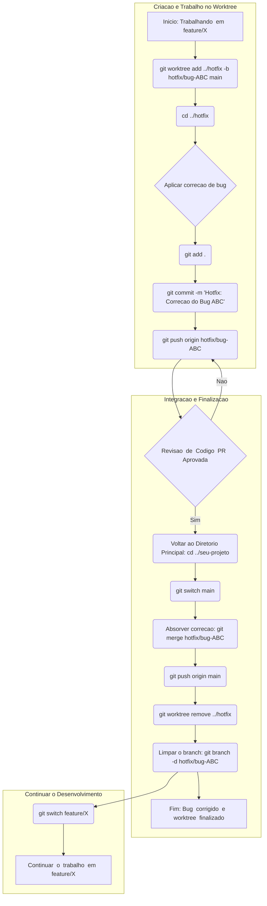

# Como crie uma worktree para outra branch

## Objetivo: Trabalhar em múltiplas branches sem mudar a pasta principal.

Para criar uma worktree para outra branch, você pode usar o comando 'git worktree add'. Isso permite ter vários diretórios de trabalho conectados ao mesmo repositório, cada um com uma branch diferente, sem precisar clonar o projeto várias vezes.

### Como funciona?

Cada worktree é uma cópia independente de uma branch do mesmo repositório, mas todas compartilham o mesmo histórico de commits e arquivos internos do Git. Isso significa que você não duplica todo o repositório, economizando espaço em disco.


1. Fluxo de Trabalho Tradicional (Sem git worktree)

Estrutura do Diretório:

/projeto-sem-worktree  
├── .git/               \<- Repositório Git principal  
├── index.html  
├── src/  
│   ├── app.js  
│   └── styles.css  
├── .gitignore  
└── README.md

2. Fluxo de Trabalho com git worktree

Estrutura do Diretório:

/caminho/do/seu/projeto/  
├── projeto-com-worktree/       \<- \*\*Worktree Principal\*\* (ex: no branch: feature/novo-recurso)  
│   ├── .git/                   \<- Repositório Git real (compartilhado)  
│   ├── index.html  
│   └── src/  
│       ├── app.js              \<- Com alterações em andamento (não commitadas)  
│       └── ...  
└── hotfix-critico/             \<- \*\*Worktree Vinculado\*\* (no branch: hotfix/bug-critico)  
    ├── .git                    \<- É um arquivo que aponta para o .git principal  
    ├── index.html  
    └── src/  
        ├── app.js              \<- Com a correção aplicada e commitada  
        └── ...


OBS: Mais detalhado em '15.exemplo-completo.md'

#### Exemplo rápido

Imagine que você está trabalhando na sua branch principal (main) e 'precisa iniciar uma correção de bug rápida'.

1. Crie um novo worktree:
    'git worktree add ../hotfix main'
    * Este comando cria um novo diretório chamado ../hotfix e faz o checkout da branch main lá.

2. Trabalhe na correção:

```sh
cd ../hotfix
```

* Agora você está no novo diretório e pode fazer suas alterações na branch main.

3. Volte ao trabalho original:
'cd -'

```sh
cd -
```

3.1. Como navegar e gerenciar worktrees
Listar os worktrees: Para ver todos os worktrees existentes e seus respectivos caminhos, use o comando 'git worktree list'. A saída mostrará o diretório de cada um e o branch associado.

```sh
git worktree list
```
```
~/meu-projeto 5b67eb2 [main]
~/meu-projeto-hotfix 2ff5902 [hotfix-123]
```

3.2. Mudar de diretório: Use o comando cd com o caminho que você obteve no passo anterior.

Para ir para o worktree do hotfix:
```sh
cd ~/meu-projeto-hotfix
```

Para voltar ao worktree principal:
```sh
cd ~/meu-projeto 
```

* Uma vez dentro do diretório de um worktree, todos os comandos Git (git status, git commit, etc.) que você executar se aplicarão àquele worktree e ao seu branch específico.

* Você retorna ao seu diretório principal, onde suas alterações na funcionalidade original permanecem intactas. 

### Passo a passo para criar uma worktree

- Suponha que você já esteja no diretório principal(main ou master ou etc...) do seu projeto e queira trabalhar em uma branch chamada feature-x.

1. Crie a worktree

- Execute o comando git worktree add para criar um novo diretório com o nome da sua branch e fazer o checkout dela automaticamente.

```sh
git worktree add ../feature-x feature-x
```

 * ../feature-x: É o caminho do novo diretório que será criado. O comando cria um diretório na mesma hierarquia do seu projeto principal.
 * feature-x: É o nome da branch que será usada na nova worktree.

2. Verifique as worktrees

- Para listar todas as worktrees vinculadas ao seu repositório, execute:

```sh
git worktree list
```

- A saída mostrará o diretório, o hash do commit e a branch de cada worktree.

3. Trabalhe na nova worktree

- Navegue até o novo diretório que foi criado (cd ../feature-x) e trabalhe como se estivesse em um clone separado. As alterações feitas aqui não afetarão o estado do seu diretório principal.

### Gerenciando worktrees



 * Criar uma nova branch na worktree: Se a branch ainda não existir, você pode criá-la e usar a worktree com um único comando:

```sh
git worktree add -b <nome_da_nova_branch> <caminho>
```

 * Remover uma worktree: Quando terminar o trabalho na branch e quiser remover o diretório da worktree, use o comando git worktree remove:

```sh
git worktree remove <caminho>
```

### Vantagens de usar worktrees

 * Multitarefa sem interrupção: Resolva um bug em uma branch enquanto o seu trabalho principal fica isolado, sem a necessidade de git stash ou git checkout.
 * Melhor desempenho: Uma worktree é mais eficiente do que clonar o repositório, pois compartilha a maior parte dos arquivos com o repositório principal, economizando espaço em disco.
 * Histórico e staging separados: Cada worktree tem seu próprio índice e diretório de trabalho, garantindo que as mudanças em uma não interfiram nas outras. 

#### Por que usar git worktree(Reforço)?

Essa funcionalidade é útil para quando você precisa trabalhar em várias tarefas ao mesmo tempo sem atrapalhar seu diretório principal. Por exemplo: 

 * Corrigir um bug urgente: Você está no meio do desenvolvimento de uma nova funcionalidade, mas precisa parar para corrigir um problema crítico. Com git worktree, você não precisa fazer stash (salvar temporariamente) suas mudanças. Basta criar um novo worktree, ir para a branch de correção e trabalhar nela.
 * Revisar código: Você pode criar um worktree temporário para testar o código de um colega sem afetar o seu trabalho atual. Quando terminar, basta remover o worktree.
 * Comparar versões: Facilita a comparação de diferentes versões ou branches lado a lado.

### Fluxograma de exemplo:



Extra: https://dev.to/yankee/practical-guide-to-git-worktree-58o0#:~:text=Git%20worktree%20to%20the%20rescue,Track%20remote%20branch
-----

## Exemplo

Esta é uma ótima maneira de entender o benefício do git worktree\! Ele permite que você tenha várias cópias de trabalho (diretórios com arquivos) de um mesmo repositório, cada uma em um *branch* diferente, sem a necessidade de clonar o repositório inteiro ou fazer *stash* de mudanças para trocar de *branch*.

Abaixo estão duas árvores de projeto de exemplo para ilustrar o contraste, usando um cenário comum: você está trabalhando em um recurso (feature/novo-recurso) e precisa rapidamente corrigir um bug urgente (hotfix/bug-critico) no main.

---

## **1\. Fluxo de Trabalho Tradicional (Sem git worktree)**

Neste cenário, você tem apenas um diretório de trabalho principal. Para mudar para a correção urgente, você precisa salvar seu trabalho inacabado com git stash ou git commit (um "WIP" \- *Work In Progress*), fazer a correção, e depois voltar.

### **Estrutura do Diretório**

/projeto-sem-worktree  
├── .git/               \<- Repositório Git principal  
├── index.html  
├── src/  
│   ├── app.js  
│   └── styles.css  
├── .gitignore  
└── README.md

### **O Problema (A Alternância de Contexto)**

1. Você está trabalhando no feature/novo-recurso com mudanças não commitadas em src/app.js.  
2. Um bug urgente é relatado no main.

**Comandos Necessários para Mudar:**

1. **Salvar o trabalho atual:**  
   Bash  
   $ git stash push \-m "WIP: Feature A antes do hotfix"

   *(Ou você teria que fazer um commit "WIP" se não quisesse usar stash)*  
2. **Mudar para o main:**  
   Bash  
   $ git checkout main

3. **Criar/Mudar para o branch de correção:**  
   Bash  
   $ git switch \-c hotfix/bug-critico

4. **Fazer a correção e commitá-la.**  
5. **Voltar para o trabalho anterior:**  
   Bash  
   $ git checkout feature/novo-recurso

6. **Restaurar o trabalho salvo:**  
   Bash  
   $ git stash pop

**Desvantagens:**

* **Interrupção do Fluxo:** Você precisa pausar, salvar o estado, e restaurar.  
* **Limitação de Ferramentas:** Apenas uma IDE ou editor está aberta com os arquivos do *branch* atual.  
* **Overhead:** Você gasta tempo com stash/pop ou commits "WIP".

---

## **2\. Fluxo de Trabalho com git worktree**

Neste cenário, você cria um novo diretório de trabalho **anexado ao mesmo repositório Git** (.git), permitindo que você trabalhe simultaneamente em diferentes *branches* em diferentes diretórios, sem interferência.

### **Estrutura do Diretório**

O diretório principal (projeto-com-worktree) contém o repositório principal e o *worktree* principal (checado no feature/novo-recurso). Ao lado dele, é criado um novo diretório, que é o *worktree* vinculado (../hotfix-critico).

/caminho/do/seu/projeto/  
├── projeto-com-worktree/       \<- \*\*Worktree Principal\*\* (ex: no branch: feature/novo-recurso)  
│   ├── .git/                   \<- Repositório Git real (compartilhado)  
│   ├── index.html  
│   └── src/  
│       ├── app.js              \<- Com alterações em andamento (não commitadas)  
│       └── ...  
└── hotfix-critico/             \<- \*\*Worktree Vinculado\*\* (no branch: hotfix/bug-critico)  
    ├── .git                    \<- É um arquivo que aponta para o .git principal  
    ├── index.html  
    └── src/  
        ├── app.js              \<- Com a correção aplicada e commitada  
        └── ...

### **O Fluxo (O Salto de Contexto)**

1. Você está trabalhando no feature/novo-recurso no diretório /projeto-com-worktree (com mudanças não commitadas em src/app.js).  
2. Um bug urgente é relatado no main.

**Comandos Utilizados (Assumindo que você está em /caminho/do/seu/projeto/projeto-com-worktree):**

1. **Crie um novo *worktree* para a correção urgente:**  
   Bash  
   \# Cria um novo diretório (../hotfix-critico) no mesmo nível do worktree principal  
   \# e checa o branch 'main' nele, criando um novo branch 'hotfix/bug-critico'.  
   $ git worktree add ../hotfix-critico \-b hotfix/bug-critico main

2. **Mude para o novo diretório de trabalho:**  
   Bash  
   $ cd ../hotfix-critico/

3. Faça a correção:  
   (Abra este novo diretório em uma nova janela da IDE, se quiser, ou use o terminal)  
   Bash  
   $ \# Edite src/app.js e aplique a correção  
   $ git add src/app.js  
   $ git commit \-m "Hotfix: Corrigido bug crítico na função X"  
   $ git push origin hotfix/bug-critico

4. **Volte para o trabalho original (instantaneamente):**  
   Bash  
   $ cd ../projeto-com-worktree/

   *Seu trabalho não commitado no feature/novo-recurso está **exatamente como você o deixou**, sem a necessidade de stash ou pop.*

**Vantagens:**

* **Trabalho Simultâneo:** Não há necessidade de stash ou commits WIP. O trabalho em feature/novo-recurso não é afetado.  
* **Isolamento:** Os ambientes de trabalho estão completamente isolados (diferentes diretórios), o que é ideal para testes e para manter a organização da IDE/ferramentas.  
* **Rapidez:** A troca de contexto é apenas um cd \<diretorio\>, em vez de múltiplos comandos Git.

Para ver os worktrees ativos, você pode rodar em qualquer um dos diretórios:

Bash

$ git worktree list  
/caminho/do/seu/projeto/projeto-com-worktree  c6a4d7d \[feature/novo-recurso\]
/caminho/do/seu/projeto/hotfix-critico       1e2b3c4 \[hotfix/bug-critico\]
