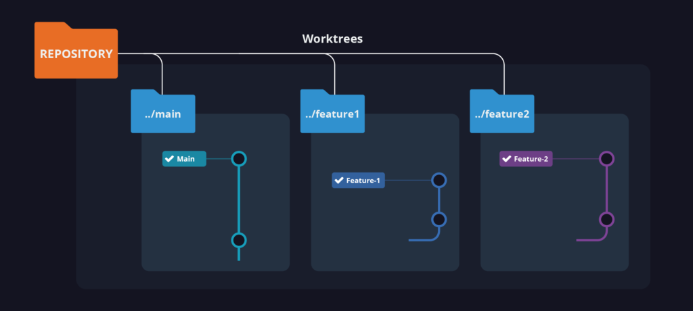
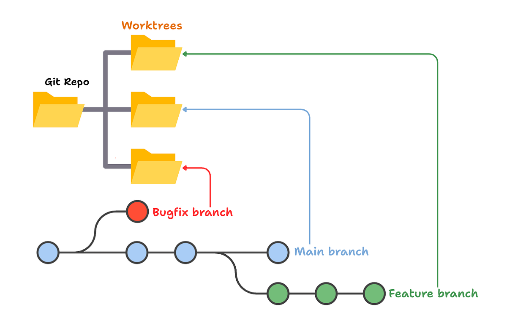
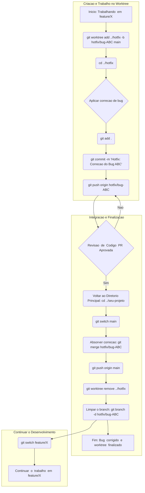

# Git Worktree: Criando múltiplos diretórios de trabalho para branches diferentes

## Objetivo
Permitir trabalhar em múltiplas branches ao mesmo tempo sem precisar fazer `stash` ou `checkout` no diretório principal do projeto.

---

## O que é um worktree
- Uma **worktree** é uma cópia independente de uma branch do mesmo repositório Git.
- Compartilha o histórico e os objetos do repositório principal, mas tem seu próprio diretório de trabalho e índice (staging area).
- Economiza espaço em disco em comparação a múltiplos clones.

---

## Criando um Worktree



### Passo 1: Criar um novo diretório de trabalho para a branch
```sh
git worktree add <caminho_do_novo_diretorio> <branch_existente>
````

**Exemplo:**

```sh
git worktree add ../hotfix main
```

* Cria o diretório `../hotfix` e faz checkout da branch `main` nele.
* Se quiser criar uma branch nova na worktree:

```sh
git worktree add -b <nome_da_nova_branch> <caminho> <branch_base>
```

Exemplo:

```sh
git worktree add -b hotfix/bug-123 ../hotfix main
```

---

### Passo 2: Navegar para o worktree

```sh
cd ../hotfix
```

* Aqui você pode editar arquivos, criar commits e fazer push normalmente.
* As alterações neste diretório não afetam a worktree principal.

---

### Passo 3: Listar worktrees existentes

```sh
git worktree list
```

**Saída exemplo:**

```
~/meu-projeto 5b67eb2 [main]
~/meu-projeto-hotfix 2ff5902 [hotfix-123]
```

---

### Passo 4: Remover um worktree

* Quando terminar de trabalhar em um worktree:

```sh
git worktree remove <caminho>
```
---
#### Exemplo de como fica a extrutura com e sem o worktree

**Estrutura do Diretório**:

/projeto-sem-worktree  
├── .git/               \<- Repositório Git principal  
├── index.html  
├── src/  
│   ├── app.js  
│   └── styles.css  
├── .gitignore  
└── README.md

**Estrutura do Diretório**:

/caminho/do/seu/projeto/  
├── projeto-com-worktree/       \<- \*\*Worktree Principal\*\* (ex: no branch: feature/novo-recurso)  
│   ├── .git/                   \<- Repositório Git real (compartilhado)  
│   ├── index.html  
│   └── src/  
│       ├── app.js              \<- Com alterações em andamento (não commitadas)  
│       └── ...  
└── hotfix-critico/             \<- \*\*Worktree Vinculado\*\* (no branch: hotfix/bug-critico)  
    ├── .git                    \<- É um arquivo que aponta para o .git principal  
    ├── index.html  
    └── src/  
        ├── app.js              \<- Com a correção aplicada e commitada  
        └── ...



---

## Fluxo prático

1. Criar worktree para correção urgente:

```sh
git worktree add -b hotfix/bug-ABC ../hotfix main
```

2. Navegar para a worktree:

```sh
cd ../hotfix
```

3. Fazer alterações, commit e push:

```sh
git add .
git commit -m "Hotfix: Corrigido bug ABC"
git push origin hotfix/bug-ABC
```

4. Voltar para o diretório principal:

```sh
cd ../projeto-com-worktree
```

5. Absorver correção:

```sh
git merge hotfix/bug-ABC
git push origin main
```

6. Remover worktree e branch temporária:

```sh
git worktree remove ../hotfix
git branch -d hotfix/bug-ABC
```

#### Exemplo grafico:

---
## Vantagens do uso de worktrees

* **Trabalho simultâneo:** Correções rápidas ou testes sem interromper o desenvolvimento principal.
* **Isolamento:** Cada worktree possui seu próprio diretório de trabalho e staging.
* **Economia de espaço:** Não é necessário clonar o repositório inteiro para cada branch.
* **Fluxo de trabalho contínuo:** Não precisa usar `stash` para alternar entre branches.

---

## Conclusão

O `git worktree` é extremamente útil para:

* Corrigir bugs críticos sem interromper o desenvolvimento atual.
* Testar branches de colegas de equipe.
* Comparar múltiplas versões simultaneamente.
* Evitar uso excessivo de `stash` ou commits WIP.

